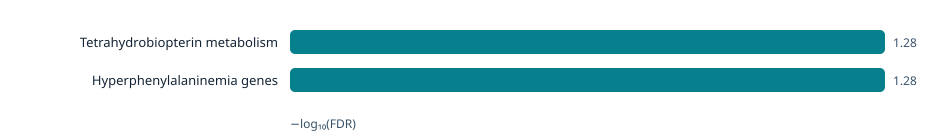

# CMHS VarEnrich

**Human rare-variant enrichment and interactive visualization**

CMHS VarEnrich connects variants to genes and tests whether the affected genes are over-represented in rare diseases, phenotypes, pathways, or Gene Ontology categories. It produces a searchable, self-contained HTML report and publication-ready SVG graphics without uploading patient data.



> **Development status:** version 0.1 research release. Not validated for diagnosis or clinical decision-making.

## Why it is different

- Keeps the path from variant → gene → enriched term → statistical evidence traceable.
- Requires an explicit background universe, such as all genes on the panel or all genes that passed analysis QC.
- Reports one-sided hypergeometric p-values, Benjamini–Hochberg FDR, fold enrichment, and contributing genes.
- Accepts simple gene lists and CSV/TSV variant tables.
- Generates a local interactive report with no external JavaScript or patient-data upload.
- Designed to grow into WEGO-style ontology views and cohort rare-variant burden analysis.

## Start the graphical application

After installation, run:

```bash
varenrich gui
```

The browser interface is available only through a random-token URL on `127.0.0.1`. It accepts gene lists, delimited variant tables, and locally annotated VCF/VCF.GZ files. Reports are saved under `Documents/CMHS-VarEnrich-Results`.

## Try the synthetic demonstration

Python 3.10 or newer is required for source installation.

```bash
python -m venv .venv
source .venv/bin/activate        # Windows: .venv\Scripts\activate
python -m pip install -e .

varenrich analyse \
  --variants examples/demo-variants.tsv \
  --universe examples/demo-universe.txt \
  --gene-sets examples/demo-gene-sets.gmt \
  --output demo-results
```

Users who prefer not to install Python can download the standalone application for macOS, Windows, or Linux. See [platform installation and trust](docs/platform-support.md).

Open `demo-results/report.html`. The bundled demonstration is entirely synthetic and contains no patient information.

The same analysis accepts an annotated VCF:

```bash
varenrich analyse \
  --vcf examples/demo-annotated.vcf \
  --universe examples/demo-universe.txt \
  --gene-sets examples/demo-gene-sets.gmt \
  --max-af 0.01 --pass-only \
  --output demo-vcf-results
```

## Download current human annotations

This explicit command downloads only public annotations—not patient data—and produces a combined GMT plus a checksum manifest:

```bash
varenrich download-resources --output varenrich-human-resources
```

It currently builds human GO, HPO, Reactome, and ClinVar disease collections. Keep the generated manifest with each analysis to identify the exact source-file and output SHA-256 hashes. Existing local annotation bundles never update silently. See [docs/data-sources.md](docs/data-sources.md) for provenance and attribution details.

## Inputs

### Gene list

One HGNC gene symbol per line. A header named `gene`, `gene_symbol`, `symbol`, or `hgnc_symbol` is allowed.

### Variant table or VCF

A comma-, tab-, or semicolon-delimited table containing a gene column. Optional columns currently retained for traceability include `variant`, `consequence`, `classification`, `disease`, and `sample`.

VCF input must already contain gene annotations from VEP `CSQ`, SnpEff `ANN`, or an INFO field named `GENE`, `SYMBOL`, or `Gene.refGene`. Reference and missing sample genotypes are excluded. Filters include `--min-quality`, `--max-af`, `--pass-only`, and repeatable `--classification` terms.

### Background universe

One gene per line representing **every gene that could have entered the query list**. For a clinical panel analysis, this is normally the adequately tested panel genes. Using every human gene for a small targeted panel creates biased p-values.

### Annotation collection

GMT format: term identifier, `Source|Term name`, then gene symbols, separated by tabs.

```text
HP:0001250	HPO|Seizure	SCN1A	SCN2A	STXBP1
```

## Outputs



- `report.html`: self-contained interactive report and embedded SVG chart
- `figures/enrichment-bars.svg`, `enrichment-bubbles.svg`, and `term-gene-network.svg`: editable publication figures
- `enrichment-results.tsv`: complete machine-readable results
- `filtered-variants.tsv`: retained variant evidence when a variant input is used
- `analysis-metadata.json`: method, version, input type, universe size, and resource paths

## Statistical scope

The current method is over-representation analysis for an unranked gene list. It is not a replacement for ancestry-aware, coverage-aware case-control rare-variant burden testing. Those models are planned as a distinct workflow so their assumptions cannot be confused with a hypergeometric test.

## Privacy and clinical use

Analysis runs locally and never makes network requests. Only the explicit annotation-install/update command or GUI button contacts the documented public database hosts; it does not read or transmit patient inputs. Inputs may still contain identifiable sample labels, so outputs must be handled under the same institutional controls as the source data.

CMHS VarEnrich is research software. ClinVar and other public resources contain submitted interpretations that require expert review; enrichment significance does not establish pathogenicity, causality, or diagnosis.

## Roadmap

See [docs/roadmap.md](docs/roadmap.md) for the completed v0.1 scope and planned identifier normalization, ontology-tree views, additional exports, and cohort burden models.

The statistical method and assumptions are documented in [docs/methods.md](docs/methods.md), with independent numerical checks in [docs/validation.md](docs/validation.md). Security and data-handling details are in [SECURITY.md](SECURITY.md).

## License

MIT © Human Genomics Solutions. External annotation databases retain their own licenses and attribution requirements.
